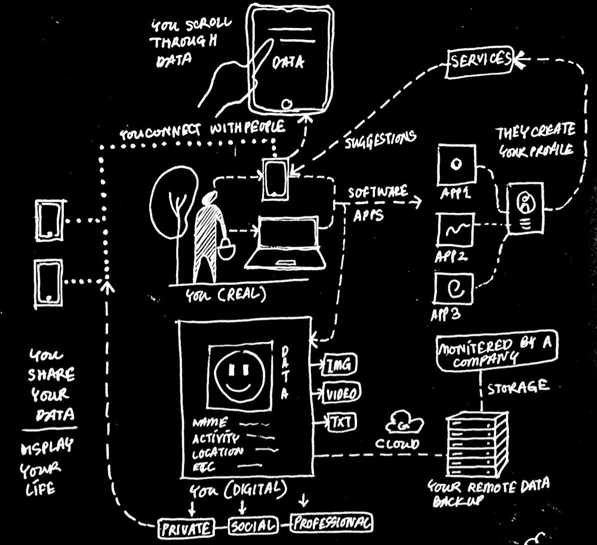
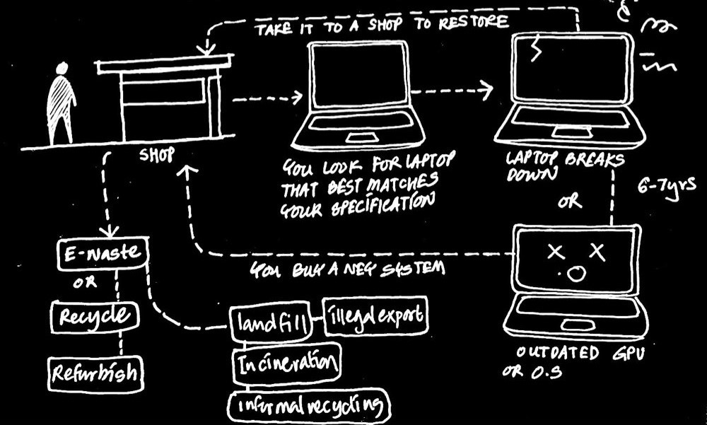
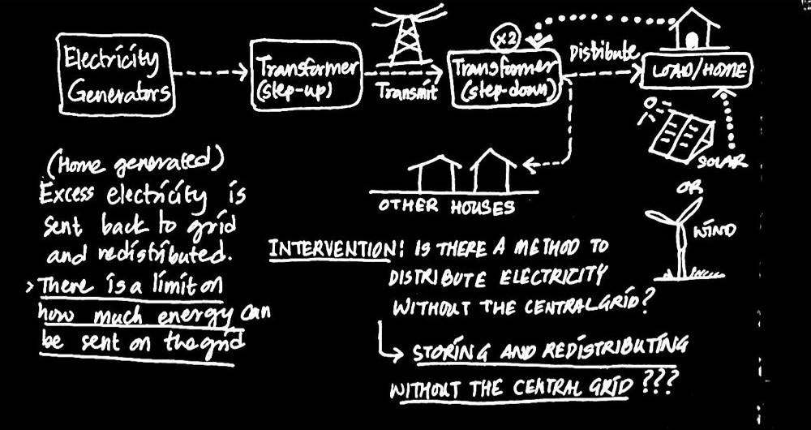
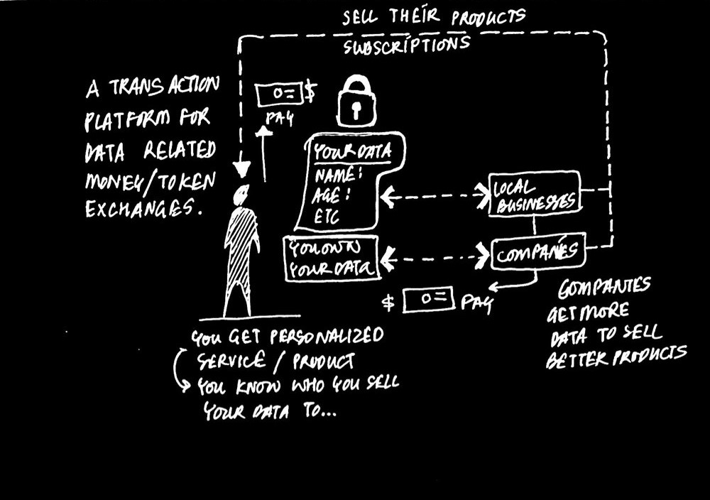
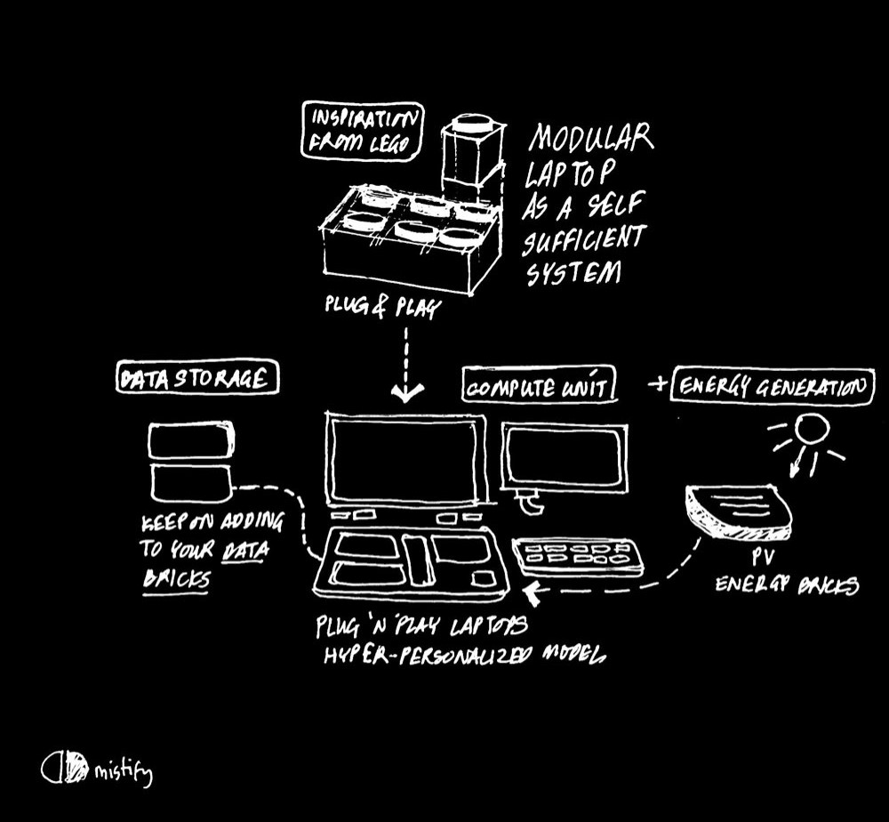

# DESIGN 8131 Specialization Project 1

**Fall 2025**  

- **Student:** Rajvi Ranjit Patil
- **Email:** rp674@cornell.edu

- **Instructor:** Jose Sanchez

--- 

## Current Ecosystems

### Personal Data, Data Transfer & Digital Identity

Most digital platforms collect and store user data in centralized systems. This data is shared or sold to third parties, often without clear consent. Users receive free services in return, but have little control over how their data is used.

_How might we give users more control over their data and create value beyond the services offered by companies?_

_How might we build a secure user-owned database that connects to sites, allows selective sharing, and protects private data?_

_How might we design a decentralized data storage system, like a wallet, fully controlled by the user?_

### Laptop Lifecycle

Most laptops today depend on external energy sources, cloud storage, and fixed hardware configurations. When performance needs change, users often replace the entire device rather than upgrade parts. This creates a linear cycle of manufacture, use, and disposal, with limited user control over repair, energy, or data.

_How might we design laptops that generate their own energy and store data locally?_

_How might we build modular laptops that adapt to each user’s needs?_

### Energy Distribution

The current energy system is centralized, with electricity generated at large power plants and transmitted through high-voltage lines to homes and businesses. Residential solar or small-scale generation is limited by regulations, and any excess energy is fed back to the grid. The utility then distributes this energy to other consumers, with homeowners typically receiving credit rather than direct payment from neighbors.

_How might we enable people to sell excess electricity directly to their neighbors instead of only through the grid?_

_How might we simplify global investment in renewable energy by centering it around renewable energy credits?_

_________________________________________________________________________________________________________________________________________________________________________________________________________________________________________
## Proposed Models

### Own Your Data

### Modular Laptop

_________________________________________________________________________________________________________________________________________________________________________________________________________________________________________
## State of Knowledge of field

Personal Knowledge Map

1. Architecture & Design

_Core Skills:_

-Sketching & Ideation
-Spatial Design & Planning
-Making & Craftsmanship
-Understanding Local Norms & Regulations

_Experience/Projects:_

-Traditional architectural projects
-Site analysis and feasibility studies
-Integration of design with local regulations

2. Real Estate & Development

_Core Skills:_

-Client Negotiations
-Onsite Decision Making
-Management & Coordination
-Raising Capital / Investment Strategy

_Experience/Projects:_

-Working as a partner in real estate development
-Project management across design & construction

3. Design Technology & Fabrication

_Core Skills:_

-Transformable / Deployable Structures
-Kinetic Facades

Digital Fabrication

-Rapid Prototyping
-Microcontrollers & Hardware Integration

_Experience/Projects:_

-MakerLab: learned advanced digital fabrication methods
-Devices / electronics experimentation
-Laptop project development
-Prototype creation using CAD/CAM & other fabrication tools

4. Computational Design & AI

_Core Skills:_

-Transformers architecture
-Machine learning on small datasets
-Algorithmic thinking & model implementation

_Experience/Projects:_

-Exploring neural network architectures
-Thinking about low-data training models
-Conceptual integration of AI with physical systems

5. Energy & Sustainability

_Core Skills:_

-Energy market & business understanding
-Renewable energy systems (conceptual understanding)
-Systems thinking in distributed energy

_Experience/Projects:_

-Studying energy distribution & generation
-Designing concepts for user-controlled energy systems

6. Cross-domain / Integrative Skills

-Rapid problem-solving and ideation across design, tech, and business
-Holistic systems thinking (design ↔ tech ↔ business)
-Product conceptualization and prototyping
-Bridging physical and digital domains
_________________________________________________________________________________________________________________________________________________________________________________________________________________________________________
## Map of Community of Practice

1)_Solid_ by Tim Berners Lee is a web decentralization platform.This project gives users control over their personal data. It stores information in individual data pods rather than centralized servers. Users can selectively share data with apps while maintaining privacy and ownership.

2)_Framework Computers_ makes modular laptops designed for easy repair, upgrade, and customization. Their system allows users to replace components like the keyboard, battery, or ports without discarding the whole device.

3)_Brooklyn Microgrid_ The Brooklyn Microgrid (BMG) is a community-driven initiative that began in 2016 in Brooklyn, New York. It enables residents to buy and sell locally (P2P) generated solar energy using a blockchain-based platform called Exergy. 

_________________________________________________________________________________________________________________________________________________________________________________________________________________________________________
## Research Methods

_________________________________________________________________________________________________________________________________________________________________________________________________________________________________________
## Technology Eco-system Diagram

_________________________________________________________________________________________________________________________________________________________________________________________________________________________________________
## Intent of purpose to 'Radical Prototype'

## Proposed Color Scheme ffbe0b,fb5607,ff006e,8338ec,3a86ff,8ac926

